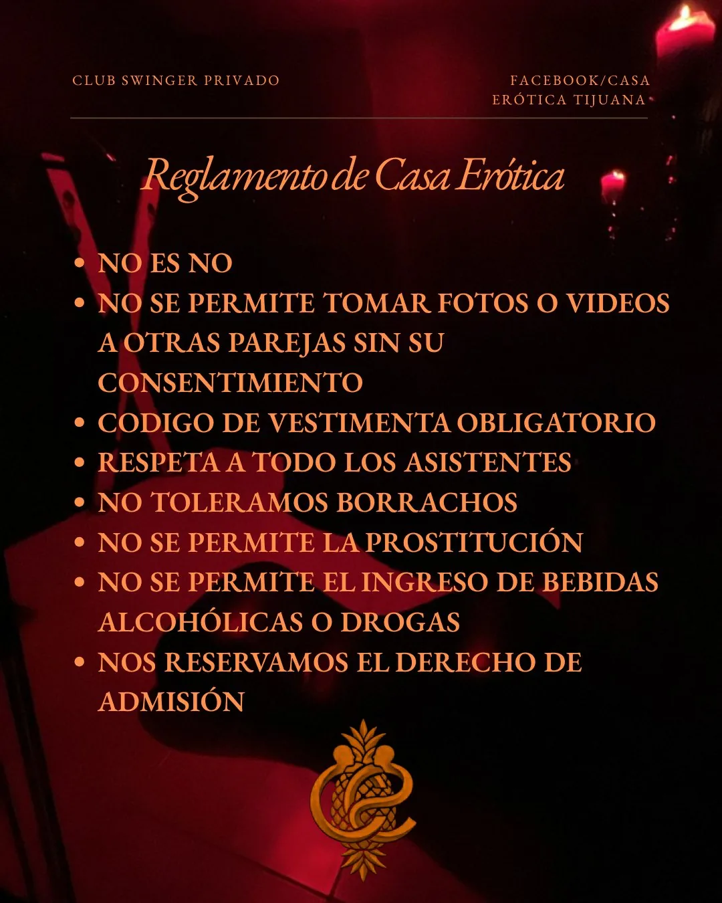
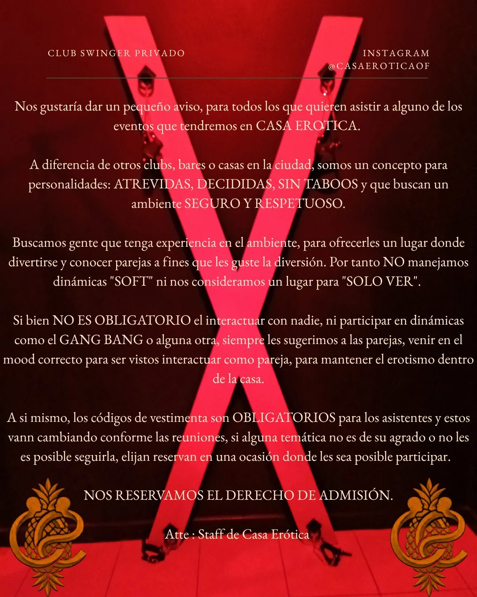

## Casa Erótica, Tijuana: el mejor red room de Tijuana

**Casa Erótica** se anuncia como un verdadero espacio para exploradores kink en Tijuana. En sus redes manejan una comunicación que te vende la idea de un lugar curada, de comunidad real, y hay que reconocerlo: el espacio físico lo respalda. Pero una cosa es el continente y otra el contenido. Hedónica y yo fuimos un fin de semana y la experiencia fue distinta a lo que esperábamos.

No llegamos con expectativas al azar. Varias parejas de la comunidad nos habían hablado muy bien del lugar antes de ir: lo describían como un espacio genuinamente kinkster, bien organizado y con una vibra de apertura real. Eso hizo que llegáramos con el ánimo alto.

Esta reseña describe lo que vivimos, tal como fue. Mi experiencia es solo una visita; la tuya puede variar.

> **📝 Nota:** Al día siguiente, los organizadores nos preguntaron por WhatsApp cómo nos habíamos sentido. Les contamos. Escucharon, y nos extendieron una cortesía para volver esta semana a un evento **solo para parejas decididas**. Próximamente podría hacer una segunda reseña.

> **✅ En resumen:**
> - **¿Vale la pena?** → El espacio sí, la noche no siempre. Depende mucho de quién asista y la dinámica del grupo esa noche.
> - **¿Es seguro?** → Sí. El host está pendiente, el acceso es por reservación y el ambiente dentro es respetuoso.
> - **Costo:** $600 MXN parejas / $800 MXN singles / mujeres solas entran gratis.
> - **Horario:** Viernes (noches exclusivas parejas) y sábados (singles permitidos). Puertas abren a las 10:00 p.m. . Dinámicas empiezan a las 11:00 p.m | Gang Bang 12:00 a.m.  Hasta el amanecer
> - **Restricción clave:** Solo por reservación previa con depósito del 50%. Máximo 10 parejas por evento.
> - **¿Hay interacción social?** → Variable. La noche que fuimos, hubo grupos que estaban muy cerrados entre sí.
> - **Lo mejor:** El Red Room es genuinamente impresionante: jaula, columpio, cruz de San Andrés, sillón tántrico y pared completa de artilugios. Barra libre incluida.
> - **Lo peor:** El código de vestimenta no se respeta, la dinámica de grupos cerrados puede dejarte fuera y el formato del gang bang termina siendo casi un peep show.

---

## Cómo acceder a Casa Erótica

La ubicación es secreta. Por respeto a la comunidad que nos abrió sus puertas, solo podemos confirmar que es una casa en la **Colonia Obrera**. El acceso es por reservación obligatoria, y conseguirlo requiere un poco de trabajo de rastreo digital: la casa anuncia sus eventos cada semana en **X (Twitter)** y en sus grupos de WhatsApp.

Manejan un sistema de dos grupos: uno **abierto** —donde cualquiera puede unirse para ver anuncios— y uno **privado**, exclusivo para quienes ya han visitado presencialmente. El grupo privado tiene más de 120 personas, el abierto muchas más. Me hubiera gustado un grupo más pequeño, dedicado solo a quienes van a ir esa noche; la idea de conocerse antes del evento es muy buena, pero se diluye en tanto ruido.

Para reservar es indispensable pagar el **50% por adelantado**. El lugar admite un máximo de **10 parejas por evento**, lo que garantiza que no se satura.

- **Costos:** $600 MXN por pareja / $800 MXN singles / mujeres solas gratis.
- **Horarios:** Viernes (exclusivo parejas) y sábados (singles permitidos). Uno o dos eventos por semana con temáticas distintas.
- **Reservaciones:** Vía grupo de WhatsApp o X (Twitter).

### 📲 Contacto

- **WhatsApp:** [+52 1 664 126 7104](https://api.whatsapp.com/send?phone=5216641267104&text=%C2%A1Hola!%20Supe%20de%20Casa%20Er%C3%B3tica%20en%20MxKinksters.%20%C2%BFPueden%20darme%20informaci%C3%B3n%20sobre%20el%20pr%C3%B3ximo%20evento%3F)
- **X (Twitter):** [@CasaErotica664](https://x.com/CasaErotica664)
- **Instagram:** [@casaeroticaof](https://www.instagram.com/casaeroticaof/)

Un detalle práctico: la ubicación dentro de la colonia es algo complicada. Google Maps nos llevó a la calle equivocada. La buena noticia es que **los organizadores estuvieron pendientes** para guiarnos por WhatsApp hasta la puerta. El estacionamiento en la zona no fue problema; hay bastante espacio en la calle.

---

## ¿Qué hay adentro de Casa Erótica?

Bajamos unas escaleras y al cruzar la puerta el ambiente cambió de golpe: luz roja, un letrero luminoso que dice **"Adults Only"** y unas cortinas de tela roja. Al cruzarlas, una sala con varios sillones, es un espacio de convivencia, una pequeña barra para ordenar bebidas y, al fondo, dos habitaciones.

**La habitación de la derecha** tiene dos camas gigantes que ocupan prácticamente todo el cuarto. Esta es la zona de juego abierto; el gang bang de la noche ocurre aquí.

**El Red Room** (habitación izquierda) es donde está todo el equipamiento kink. Es un cuarto completo, genuinamente bien montado:

- **Jaula**
- **Columpio**
- **Sillón tántrico**
- **Cruz de San Andrés** — la X característica del BDSM, para escenas de bondage vertical y juego de impacto
- **Pared de artilugios** — floggers, paletas, pinzas y todo lo necesario para juego de impacto y sensorial

Antes de entrar al Red Room, el host nos ofreció shots de tequila. El sistema aquí es **barra libre** — cerveza, tragos, sodas, agua. Un muy buen toque que distingue a Casa Erótica de espacios con formato BYOB (Bring Your Own Booze | Trae tu propio alcohol).

---

## Las reglas oficiales de Casa Erótica

El reglamento es claro y está publicado en sus redes. Lo transcribo tal cual:

1. **No es No** — la regla de oro, sin excepción.
2. **No se permite tomar fotos o videos a otras parejas sin su consentimiento.**
3. **Código de vestimenta obligatorio** — y va en serio; cada evento tiene su temática.
4. **Respeta a todos los asistentes.**
5. **No toleramos borrachos** — a pesar de la barra libre, el control es parte del contrato social del lugar.
6. **No se permite la prostitución.**
7. **No se permite el ingreso de bebidas alcohólicas o drogas** — la barra libre es de la casa, no BYOB.
8. **Se reservan el derecho de admisión.**

  

En papel, el reglamento es sólido. El punto 3 —código de vestimenta obligatorio— es exactamente el que nadie cumplió la noche que estuvimos. Más sobre eso adelante.

---

## La noche: lo que pasó realmente

Llegamos pasada la medianoche. Las dinámicas de presentación y los juegos de bienvenida ya habían terminado, lo cual cambia bastante la experiencia. Durante esa parte inicial hacen un **juego con aros** — lanzar un aro a unos dildos; quien no atina recibe un castigo. Dan premios a los que sí.

Al entrar al Red Room, el host nos presentó. El grupo estaba reunido alrededor de la cruz de San Andrés: una mujer con la falda levantada, los participantes tomando turnos para acariciarla como parte de su castigo por no atinar en el juego. Nos incluyeron en la ronda de inmediato.

Y entonces anunciaron que nos tocaba castigo por llegar tarde. En medio de un círculo de desconocidos, pantalones y boxers a los tobillos, y la pregunta: *"¿Golpe o Caricia?"*

Golpe. Fue muy rico. En ese punto todo iba de maravilla.

---

## El gang bang y los grupos cerrados

Al terminar los castigos, todos salieron a la sala y se anunció el gang bang en la habitación de las camas. El problema con el formato es que las camas ocupan todo el cuarto, así que **el gang bang se convierte en una especie de peep show**: puedes verlo desde la ventana o la puerta, pero de lejos, sin una integración real al espacio a diferencia de [Club Escape](/tijuana/resenas/club-escape/) donde hay sillas alrededor de la cama y mucho espacio para ver de cerca.

Ahí fue donde la noche giró. Los lugares de la sala se llenaron de inmediato y se formaron **grupos en círculos cerrados**. Hedónica y yo nos quedamos parados en medio de la sala, solos. Y no es que estuvieran discretamente jugando en los sillones o intercambiando caricias con sus parejas — nada de eso. Era literalmente una reunión de amigos: plática, risas, drinks. El gang bang en la habitación de al lado era prácticamente ignorado por todos. Ni soft play, ni contacto entre parejas, ni voyeurismo activo. Solo conversación.

Decidimos volver al Red Room. La temática de esa noche era **Lencería Roja**, así que antes de salir le hice a Hedónica un arnés tipo bodysuit con cuerdas rojas. Se quitó la ropa para lucirlo. El problema: absolutamente nadie cumplía el código de vestimenta, a pesar de que en las reglas del evento aparece como **obligatorio**.

Jugamos entre nosotros un rato. Salimos a la sala luciendo nuestros outfits de kinksters comprometidos 😎. Los círculos seguían cerrados.

El host, muy amable, se acercó a las 2 a.m. y se ofreció a presentarnos a una pareja. Fue una buena plática. Les pregunté directamente por qué nadie interactuaba. Su respuesta: ese día varias parejas habían coordinado para ponerse al día entre ellas. También nos dijeron que no nos desanimáramos, que la confianza se construye con tiempo — ellos fueron durante **seis meses antes de tener interacción real con otras parejas**.

Fue también en ese momento donde una de las organizadoras nos presentó a su esposo. Hedónica estaba luciendo su arnés de cuerdas rojas, con sus atributos bien presentes. El hombre, con mucha educación y de forma muy directa, le preguntó a Hedónica si podía tocarla y acariciarla. Ella aceptó. Fue un momento breve pero genuinamente kinkster: consentimiento explícito, sin rodeos, sin incomodidad. Exactamente como debe ser.

A las 3 a.m. era evidente que no habría más juego. Nos fuimos.

---

## Lo que dice su propio manifiesto

Hay algo que no vi antes de ir y que hubiera calibrado mejor mis expectativas: Casa Erótica publica un manifiesto muy explícito sobre el tipo de espacio que son. Lo reproduzco en sus términos:

> *"A diferencia de otros clubs, bares o casas en la ciudad, somos un concepto para personalidades: ATREVIDAS, DECIDIDAS, SIN TABOOS y que buscan un ambiente SEGURO Y RESPETUOSO. Buscamos gente que tenga experiencia en el ambiente [...] Por tanto NO manejamos dinámicas 'SOFT' ni nos consideramos un lugar para 'SOLO VER'."*

Eso lo dice todo. Casa Erótica no es un espacio de exploración gradual — es un espacio para gente que **ya sabe lo que quiere** y llega a hacerlo. La expectativa es que interactúes como pareja, que el erotismo sea visible dentro de la casa. La noche que estuvimos, los mismos asistentes contravinieron su propio manifiesto: vinieron a platicar y a ver, exactamente las dos cosas que el lugar dice no ser.

No es crítica al lugar. Es información útil para que sepas con qué mentalidad llegar — y para entender que si la noche está muerta, no es falla del espacio sino del grupo.

Y eso, curiosamente, quedó confirmado con lo que pasó al salir: los organizadores nos preguntaron directamente cómo nos habíamos sentido. Les contamos sin rodeos. Escucharon, reconocieron que la noche no fue representativa del lugar, y nos extendieron una cortesía para regresar esta semana a un evento exclusivo para **parejas decididas**. En el ambiente swinger y kink, "pareja decidida" no es un eufemismo vago — es un término muy concreto que significa que ambos integrantes de la pareja están en sintonía, con la cabeza puesta, sin ambigüedad sobre para qué están ahí. El opuesto a lo que pasó esa noche, donde varias parejas aparentemente llegaron en modo social, no en modo kinkster.

Ese gesto — preguntar, escuchar la experiencia sin ponerse a la defensiva, e invitarnos a vivir el lugar como debe ser — dice mucho del compromiso que tienen con mantener la esencia de Casa Erótica. No todos los organizadores hacen eso. Actualizaremos esta reseña después de la segunda visita.

  

---

## ¿Qué tipo de gente va a Casa Erótica?

Parejas en el rango de **30 a 50 años**, mayoritariamente. Vi algunas caras más jóvenes, pero no eran mayoría. Buena variedad de cuerpos. El nivel de alcohol era manejable — no percibí que fuera un factor problemático la noche que estuvimos.

La música iba de hip hop a reggaetón. En la sala puede funcionar. En el Red Room, mientras Hedónica y yo jugábamos, el reggaetón se sentía bastante anticlimático — se extrañaba algo más industrial o más sensual para acompañar la escena. Rammstein hubiera estado de lujo.

---

## ¿Es recomendable para primerizos?

**¿Se puede ir siendo primerizo?**
Sí, y el staff hace un esfuerzo genuino por integrarte desde el momento en que llegas. Los juegos de bienvenida — si llegas a tiempo para vivirlos — son exactamente el tipo de dinámica que rompe el hielo de forma orgánica.

**¿Es un buen lugar para iniciarse en el ambiente kink?**
Con condiciones. El Red Room es un cuarto de juegos de primer nivel para quienes ya tienen claro qué quieren hacer. Si lo que buscas es también conexión social con otras parejas, ten en mente que la comunidad puede tardar en abrirse — la pareja que conocimos esa noche lo resumió mejor que yo. La [Guía de la Comunidad Kink en Tijuana](/tijuana/blog/comunidad-kink-en-tijuana-como-conectar-y-participar/) explica cómo conectar con personas afines antes de llegar a cualquier espacio.

**¿Cómo se maneja el consentimiento?**
Bien. El formato del castigo grupal — "¿golpe o caricia?" — es consensuado y claro. El host está presente y atento. En ningún momento nos sentimos presionados o ignorados por el staff.

---

## Veredicto Final

> **⚠️ Nota:** Esta reseña refleja una única visita. La dinámica de espacios privados como este cambia drásticamente según el evento, la temática y el grupo que asiste esa noche. Lo que aquí describo es un testimonio honesto, no una verdad absoluta sobre el lugar.

El espacio me encantó. El Red Room es de los más completos que he visto en Tijuana: bien equipado, bien ambientado, con una lógica de juego real detrás de cada elemento. La barra libre es un detalle que marca la diferencia.

Pero no fue una buena noche de socialización. Los grupos cerrados, el código de vestimenta ignorado y el formato del gang bang que no invita a la participación activa dejaron una sensación de oportunidad perdida. Eso no hace a Casa Erótica un mal lugar — hace que esa noche no fuera la indicada.

Y aquí quiero ser honesto con algo más personal: llegamos preparados. Planificamos la visita con tiempo, elegimos los outfits, fabricamos accesorios, llegamos con la mente abierta y el ánimo arriba. Pusimos intención en la noche. Que todo eso haya terminado en un Red Room vacío mientras en la sala todos platicaban entre ellos... aún me deja un sabor amargo.

Los propios organizadores, al final de la noche, nos dijeron que había sido **la noche más tranquila que han tenido**, y que no es el ambiente habitual del lugar. Nos invitaron a regresar para vivir la experiencia real de Casa Erótica. Puede que lo hagamos.

Si vas, llega puntual, antes de las 11:00 p.m. para los juegos de bienvenida. Es una buena dinámica de integración y podría hacer que tu experiencia sea un poco mejor, aunque siendo honestos, no creo que hubiera cambiado mucho nuestra percepción de esta noche..

---

## Preguntas frecuentes sobre Casa Erótica Tijuana

**¿Cómo se llega a Casa Erótica Tijuana?**
La ubicación es secreta para proteger la privacidad de los asistentes. Está en la Colonia Obrera de Tijuana. Para recibir la dirección exacta debes reservar con anticipación y pagar el 50% del costo. Los organizadores te guían por WhatsApp el día del evento. Llevar poco dinero en efectivo y aparcar en la calle no es problema.

**¿Cuánto cuesta entrar a Casa Erótica?**
La entrada cuesta $600 MXN para parejas, $800 MXN para singles (hombres solos) y las mujeres solas entran gratis. Se requiere un depósito del 50% al hacer la reservación. La barra libre (alcohol, refrescos, agua) está incluida en el costo de entrada.

**¿Cómo se reserva un lugar en Casa Erótica?**
A través del grupo de WhatsApp o su cuenta en X (Twitter), donde anuncian los eventos semanalmente. El proceso es: unirte al grupo abierto, esperar el anuncio del siguiente evento y pagar el 50% por adelantado para confirmar tu lugar. El cupo es de máximo 10 parejas por noche.

**¿Qué tiene el Red Room de Casa Erótica?**
El Red Room es la habitación kink principal. Está equipado con jaula, columpio, sillón tántrico, cruz de San Andrés (para bondage y juego de impacto vertical) y una pared completa con artilugios de juego sensorial e impacto — floggers, paletas y más. Es uno de los cuartos de juego más completos de Tijuana.

**¿Qué tipo de eventos hace Casa Erótica?**
Hacen uno o dos eventos por semana con temáticas distintas (la noche que fuimos era Lencería Roja). Los viernes son noches exclusivas para parejas; los sábados permiten singles. Todos los eventos incluyen juegos grupales al inicio (el juego de los aros con premios y castigos) y terminan con un gang bang en la habitación de camas.

**¿Permiten singles en Casa Erótica?**
Los hombres solos (singles) pueden asistir los sábados con un costo de $800 MXN. Los viernes son exclusivos para parejas. Las mujeres solas entran gratis cualquier día.

**¿Es seguro ir a Casa Erótica?**
El acceso controlado por reservación y el cupo limitado (máximo 10 parejas) generan un ambiente más íntimo y manejable que el de los antros comerciales. El host está presente durante toda la noche. En nuestra visita el ambiente fue respetuoso y el staff nunca nos dejó solos cuando lo necesitamos.

**¿Se puede ir sin experiencia previa en kink?**
Sí. Los juegos de bienvenida están diseñados para integrar a los recién llegados de forma gradual y con humor. El formato de "¿golpe o caricia?" es consensuado y claro. Lo que puede resultar más difícil para primerizos es la dinámica social — los grupos establecidos tardan en abrirse a caras nuevas.

---

## Otras reseñas de espacios en Tijuana

Si quieres comparar con otros espacios de la ciudad:

- [Club Escape: Una Joya Escondida](/tijuana/resenas/club-escape/) — club privado por invitación, formato BYOB, con una comunidad más integrada y dinámica social más activa.
- [Club Medusa: El Mito y la Verdad](/tijuana/resenas/club-medusa/) — el club swinger más conocido de Tijuana, con un formato de antro comercial muy distinto.
- [Cabinas de la Revu: Los secretos detrás de la Sex Shop](/tijuana/resenas/cabinas-de-la-revu/) — las cabinas de Sexy Rosa en la Avenida Revolución, espacio orientado a la comunidad gay masculina.

---

Si algo de lo que leíste te resonó y estás en Tijuana, el [Grupo de Tijuana Kink Machín](https://www.facebook.com/groups/1395551282606115) es donde se está armando la conversación. Tú decides si te sumas.
