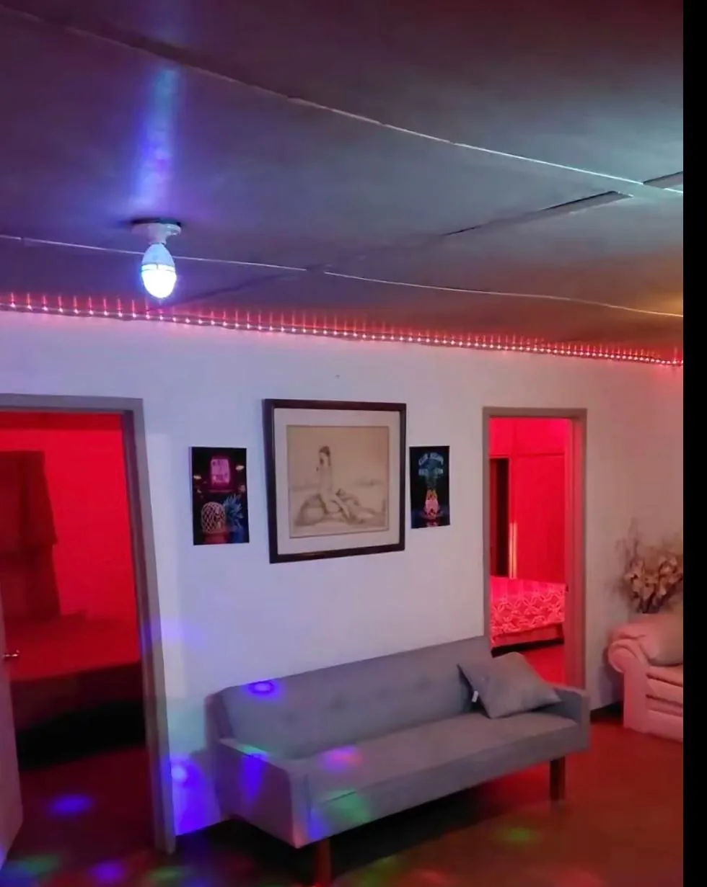
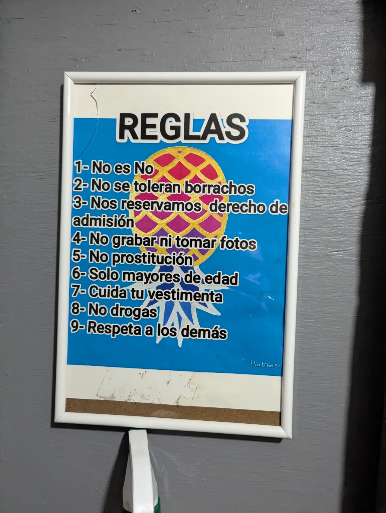

## Club Escape, Tijuana: ¿Una verdadera alternativa liberal privada?

Mientras Club Medusa opera con la lógica de un antro comercial —publicidad, cover fijo y puerta abierta a cualquiera que pague—, **Club Escape** existe en otro plano completamente distinto: es un club social privado que funciona solo por invitación. Lo encontré rastreando en los rincones más oscuros de Reddit y X (Twitter), y me costó un poco dar con la forma de entrar. Cuando lo logré, decidí ir a ver de qué iba el asunto. *(Si quieres el punto de comparación, lee primero: [Club Medusa: El Mito y la Verdad](/tijuana/resenas/club-medusa).)*

No voy a mentirte: tenía mis dudas. La etiqueta de club «secreto» me daba la sensación de que iba a amanecer en una bañera sin riñones, pero todo sea por la anécdota y por traerles información de primera mano.

> **✅ En resumen:**
> - **¿Vale la pena?** → Sí, si te gusta el ambiente de fiesta, conocer personas, socializar y toleras espacios donde el alcohol es el lubricante social.
> - **¿Es seguro?** → Totalmente. El acceso está muy controlado con entrevista previa por WhatsApp, y el respeto al consentimiento dentro del club es absoluto.
> - **Costo:** $500 MXN ($30 USD) por pareja / $600 MXN ($35 USD) hombres solos (*singles*) / mujeres solas entran gratis.
> - **Horario:** Sábados de 9:00 p.m. a 4:00 a.m. (y cuentan con una dinámica especial los miércoles por la mañana).
> - **Restricción clave:** Funciona bajo el formato **BYOB (Bring Your Own Booze)**, lo que significa que tú debes llevar tus propios consumos y bebidas. La dirección es secreta y requiere pre-registro obligatorio.
> - **¿Hay interacción social?** → Excepcional. Es lo opuesto a la frialdad de los antros comerciales; aquí el staff y los asistentes se esfuerzan por integrarte como si fuera una fiesta en casa.
> - **Lo mejor:** La calidez de la comunidad, las habitaciones de juego espaciosas e higiénicas y la excelente terraza al aire libre.
> - **Lo peor:** Si no estás consumiendo alcohol, puedes sentirte fuera de sintonía con el grupo. También puede resultar abrumador para principiantes absolutos.

---

## ¿Cómo llegar y acceder a Club Escape?

Al ser un club privado, la dirección exacta es un secreto celosamente guardado para proteger la privacidad de los miembros. Por respeto a la comunidad que me abrió sus puertas, solo puedo compartir que se ubica en una zona muy tranquila y discreta **cerca de El Guaycura**. Cuenta con bastante espacio para estacionar en los alrededores y la logística está muy bien cuidada para garantizar que nadie llame la atención al llegar.

Para asistir, el primer paso ocurre en el plano digital. Tras encontrar los datos de uno de sus eventos en X, me comuniqué con la administración vía WhatsApp. Honestamente, la atención por mensaje fue excelente: resolvieron todas mis dudas de inmediato y me hicieron una breve entrevista para validar que soy una persona real, tras lo cual me compartieron su calendario.

El espacio físico fue la sorpresa más agradable de la noche. Entras a través de una cochera discreta y, al fondo, te encuentras con unas escaleras iluminadas con luces de fiesta que te conducen a la puerta principal, donde el personal te recibe con una sonrisa y realiza el registro.

  

- **Costos de acceso:** $500 MXN por pareja, $600 MXN hombres solos (*singles*); mujeres solas entran gratis.
- **Horarios:** Abierto los sábados de 9:00 p.m. a 4:00 a.m. Miercoles mañanero de 10:00 a.m. a 1:00 p.m.
- **Formato BYOB:** No hay venta de alcohol en el interior. Es indispensable llevar tu propio consumo (bebidas, hielera y mezcladores).

### 📲 Contacto

Si quieres asistir, comunícate directamente con los organizadores:

- **WhatsApp:** [663 111 7851](https://api.whatsapp.com/send?phone=5216631117851&text=%C2%A1Hola!%20Supe%20del%20club%20en%20MxKinksters.%20%C2%BFPueden%20darme%20informaci%C3%B3n%3F)
- **X (Twitter):** [@ClubEscape23343](https://x.com/ClubEscape23343)

---

## ¿Cómo es el ambiente y la dinámica social en Club Escape?

Mi pareja y yo llegamos cerca de la medianoche y, para ser un club privado, el lugar estaba llenísimo: calculo que había entre 20 y 30 parejas conviviendo —aunque según los organizadores esa noche estuvo más tranquila de lo habitual, así que no te sorprendas si en otras ocasiones hay bastante más gente—. El ambiente es 100% social e integrado —se siente exactamente como una fiesta grande en casa de alguien que sabe organizar—. Grupos de 8 a 15 personas platicando en círculo en la terraza, otros sentados en los sillones de la sala; el tipo de convivencia que no ves ni en los mejores bares.

Se nota que la mayoría ya se conoce, que hay comunidad real detrás de esto. Pero tanto el staff como los mismos asistentes pusieron genuino esfuerzo en integrarnos desde el primer momento. Cuando la batería social empezó a agotarse, los sillones de la sala principal fueron el refugio perfecto para observar sin la presión de interactuar.

Hay un factor que vale la pena nombrar: el alcohol. En un punto de la noche el consumo era muy evidente y, aunque el ambiente estaba lejos de ser el de borrachos de cantina, el trago funcionó como el gran lubricante social de la noche. Nosotros no estábamos tomando esa noche, y en algunos momentos sí se sintió esa pequeña brecha con el resto del grupo.

Si acaso le pondría un pero: me hubiera gustado ver alguna dinámica estructurada —un juego, una actividad, algo que rompa el hielo para los que llegamos sin conocer a nadie—. Pero siendo honesto, cuando ya llevas años de comunidad y conoces a todos de nombre, probablemente eso sobra. Es una expectativa de primerizo, no una crítica real al lugar.

---

## Distribución de las Instalaciones: ¿Qué hay adentro de Club Escape?

Tras registrarnos y mencionar que era nuestra primera vez, un miembro del staff nos dio un recorrido completo por las instalaciones, un detalle de hospitalidad que se agradece un chingo. El lugar es una casa amplia adaptada con una distribución muy interesante:

* **Área de estar:** Una sala amplia con sillones cómodos y una pantalla enorme donde proyectan videos musicales. La iluminación es muy tenue y de color rojo, logrando una atmósfera íntima y privada sin sacrificar la visibilidad.
* **La cocina y la barra:** Una mini cocina con una barra que funciona como punto clave de convivencia. Cuenta con un tubo de *pole dance* (baile en tubo erótico) que, durante la noche, nos tocó ver cómo utilizaban de formas sumamente sensuales.
* **La terraza:** Una zona amplia al aire libre que resultó ser el espacio favorito de la mayoría para platicar, tomar y fumar. Hay mesas y sillas, además tiene una especie de cortina para conservar un poco la privacidad de vecinos metiches.
* **El pasillo oculto (Cuarto Oscuro):** Justo a un lado de la cocina, hay un pasillo muy bien disimulado que te conduce a un cuarto oscuro equipado con un columpio y tres pequeñas cabinas totalmente en penumbra, una de las cuales cuenta con un *glory hole* (orificio en la pared para encuentros anónimos).

---

## Las Zonas de Juego y sus Reglas

A diferencia de las incómodas y claustrofóbicas cabinas de los antros comerciales, aquí el juego se distribuye en tres habitaciones principales con camas grandes, muy bien cuidadas y limpias, cada una con su propia dinámica:

1. **Cuartos con seguro (2 habitaciones):** Diseñados para usarse ya sea a solas con tu pareja o invitando a más personas a unirse. Quienes están adentro deciden libremente si echan el seguro para tener privacidad total o si dejan la puerta abierta para que los observen.
2. **Cuarto abierto (1 habitación):** Una habitación donde la puerta nunca se cierra. Puedes usarla igual que las otras, pero aquí entras sabiendo que no habrá privacidad y que el voyeurismo (el placer de observar) y el exhibicionismo son parte del juego.

  

---

## El Evento de la Medianoche y la Acción

A la medianoche en punto, como si fuera el cuento de Cenicienta, se anunció la actividad principal en el cuarto abierto: un *gang bang* (relaciones sexuales grupales enfocadas en una persona). Sinceramente, la dinámica me resultó un poco decepcionante; la chica era hermosa y se movía delicioso, pero literalmente solo hubo dos voluntarios decididos a participar de forma activa. Esto no es culpa ni de la chica ni de la organización, simplemente así se dió.

Sin embargo, ese momento fue el detonador de la noche. A partir de ahí, el ambiente se encendió por completo: comenzaron a formarse grupos que entraban y salían de las habitaciones, algunos se encerraban con su pareja y otros invitaban a más gente a unirse, mientras que en la cocina se armó otra fiesta con bailes muy sensuales alrededor del tubo.

Los organizadores me confirmarón que **el *gang bang* es un evento fijo todos los sábados**, si eso es lo que andas buscando, atáscate que hay lodo ;) . Lo que cambia cada fin de semana es la **temática**. Algunas de las dinámicas que manejan: noche de **minifaldas**, **fiestas temáticas** de todo tipo, incluso la famosa **«mesa de postres»**: donde una chica se cubre con dulces y los asistentes pueden lamer o comer de cualquier parte de su cuerpo.

> **📝 Mentalidad Sex Positive:** Toma una pausa antes de juzgar. Este es un espacio *kink* y *sex positive*: respetamos todas las actividades sexuales consensuadas entre adultos. Hay quienes podrían ver esto como algo denigrante, pero ¿quién eres tú para decidir qué le divierte o le prende a otra persona? Para muchos, descubrir el poder de su propia seducción es profundamente empoderador; para otros, ser un objeto de deseo carnal puede ser exactamente la experiencia liberadora que buscaban.

---

## ¿Es recomendable para primerizos?

**¿Se puede ir siendo primerizo?**  
Sí, se puede, y de hecho te vas a sentir muy bienvenido gracias a la calidez del staff y de la misma gente. Nadie te va a presionar a nada y el respeto al consentimiento es total.

**¿Es un buen lugar para iniciarse en el ambiente swinger?**  
Es una excelente opción para conocer el lado comunitario del *lifestyle* —la convivencia real, no solo las cabinas—, pero con una advertencia importante: para alguien completamente nuevo, la cantidad de estímulos simultáneos puede llegar a ser abrumadora. Si tu intención es solo «mojarte los pies» de forma discreta y sin mucha interacción, podrías terminar sintiéndote un poco fuera de lugar. Aquí la mayoría ya nada en lo profundo, y se nota.

**¿Cómo se maneja el consentimiento?**  
De forma ejemplar. En ningún momento nos sentimos incómodos ni presionados. Si dices que no o prefieres quedarte solo a platicar, la gente lo respeta de inmediato y sin hacer preguntas.

---

## Veredicto Final

> **⚠️ Nota importante:** Esta reseña se basa en una **única visita un sábado por la noche**. La atmósfera y el tipo de interacción en espacios privados como este pueden cambiar drásticamente según el evento, la temática y el grupo de personas que asistan esa noche. Lo que aquí describo es un testimonio honesto de lo que viví en ese lapso, no una verdad absoluta sobre Club Escape.

Dicho eso: Club Escape me pareció un lugar impecable si lo que buscas es fiesta real, interacción genuina y sumergirte de verdad en la cultura liberal de Tijuana. La seguridad del formato privado, la limpieza de las habitaciones, la terraza y —sobre todo— la calidez de su comunidad hacen que valga completamente la pena.

Solo prepárate para la interacción constante, no olvides llevar tu propia bebida y, si quieres romper la rutina a mitad de semana, ten en cuenta que los miércoles por la mañana organizan un *gang bang* mañanero.

---

## 📅 Próximos Eventos

**Este sábado 30 de mayo** la temática es **Pole Dance** — una noche donde el tubo de la cocina va a ser el centro de todo.



Los organizadores anuncian los eventos y temáticas de cada semana en su cuenta de **X (Twitter)**: [@ClubEscape23343](https://x.com/ClubEscape23343). Si quieres saber qué se viene antes de ir, síguelos ahí.

---

Si algo de lo que leíste te resonó y estás en Tijuana, el [Grupo de Tijuana Kink Machín](https://www.facebook.com/groups/1395551282606115) es donde se está armando la conversación. Tú decides si te sumas.
