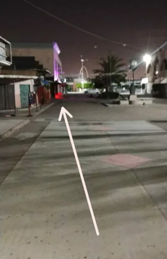
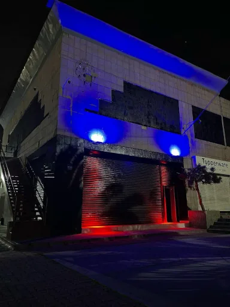
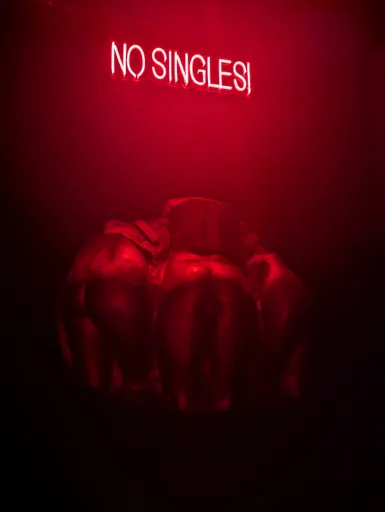
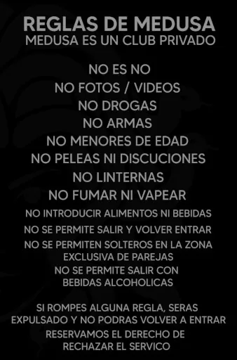

## Club Medusa, Tijuana: ¿Fama justificada o simple expectativa?

**Club Medusa** es, por reputación, el club *swinger* más famoso de Tijuana. Muchos me habían advertido que no valía la pena, pero nadie me daba razones claras. Así que decidí ir a comprobarlo por mí mismo.

> **✅ En resumen:**
> - **¿Vale la pena?** → Solo si te gusta el ambiente de antro, no buscas mucha interacción social y tu fantasía es ver porno en pantalla gigante mientras tomas cerveza barata.
> - **¿Es seguro?** → Sí, dentro. La puerta con timbre da sensación de espacio privado. La plaza exterior, de noche, se siente descuidada.
> - **Costo:** $400 MXN ($25 USD) por pareja / $800 MXN ($50 USD) hombres solos / mujeres gratis.
> - **Horario:** Viernes y sábados de 9:00 p.m. a 2:50 a.m.
> - **Restricción clave:** No entras con mochila o bolsa grande. No hay lockers.
> - **¿Hay interacción social?** → Muy poca (al menos en esta visita). Cada quien en su rollo. El staff no promueve dinámicas.
> - **Lo mejor:** Precio de cervezas ($55 MXN) + libertad total de exhibicionismo en las mesas (confirmado por administración).
> - **Lo peor:** Cabinas diminutas e incómodas, sin guardarropa, ambiente social plano (en mi experiencia).

---

## ¿Cómo llegar a Club Medusa en Tijuana?

Encontrar el lugar tiene su truco: Google Maps y Apple Maps marcan ubicaciones distintas. La dirección real es en **Plaza Viva Tijuana**, justo frente al Easy Park, a unos pasos de la garita de San Ysidro.

Cabe destacar que el entorno no es el más amigable. De noche, la plaza se siente abandonada; hay personas sin hogar buscando refugio en los alrededores y el paraje resulta bastante desalentador. Aunque no sentí peligro inminente, el ambiente exterior definitivamente no es el preámbulo ideal para una noche de fiesta.

Al estar en la plaza, **no hay un letrero con el nombre del club** que sea visible desde afuera. Lo único que resalta son unas luces LED rojas y azules iluminando una pared negra; de no ser por la música fuerte que retumbaba, no habría sabido que ahí había una fiesta. Supongo que la ausencia de letreros exteriores es parte de la discreción y privacidad que exige el concepto.

Una vez que identificas el punto y pasas el filtro de seguridad —un proceso típico de centro nocturno donde a mí me revisaron, pero a mi pareja no—, por fin aparece un letrero que dice "Club Medusa". Después, subes unas escaleras hacia una puerta de metal donde debes tocar un timbre para que te abran. Ese pequeño detalle del timbre da una agradable sensación de privacidad y espacio seguro que se agradece al dejar atrás la plaza.

  
  

- **Costos de acceso:** $400 MXN ($25 USD) por pareja, $800 MXN ($50 USD) hombres solos; mujeres solas entran gratis.
- **Horarios:** Abren viernes y sábados a partir de las 9:00 p.m. y el cierre es a las 2:50 a.m. No es necesario reservar.
- **⚠️ Restricción importante:** El club **prohíbe estrictamente la entrada con mochilas o bolsas grandes**. Dado que no cuentan con servicio de guardarropa ni *lockers*, es indispensable ir lo más ligero posible, ya que de lo contrario no te permitirán el ingreso.

---

## ¿Cómo es el ambiente en Club Medusa?

El lugar abre a las 9:00 p.m., pero nosotros entramos un sábado a las 10:30 p.m. y nos quedamos aproximadamente dos horas. Al principio el lugar estaba medio vacío, pero para las 11:30 p.m. ya se había llenado. Es un sitio ruidoso (al menos para alguien que, como yo, no es muy de antros). La música se basa principalmente en reggaetón y los éxitos habituales de la vida nocturna, acompañados por una pantalla gigante que proyecta porno de fondo. La iluminación es muy tenue, pero lo poco que alcanzaba a distinguirse se percibía limpio.

No tienen una barra fija; el servicio es a las mesas a través de meseras. El precio de la cerveza es de $55 MXN, bastante estándar para la zona. Un punto a favor es que está prohibido fumar o vapear, por lo que el ambiente se mantiene libre de olores pesados.

---

## ¿Qué hay en Club Medusa?

Debo comenzar diciendo que la distribución me tocó explorarla por cuenta propia, ya que en ningún momento el personal del *staff* se acercó a preguntarme si era mi primera vez o se ofreció a explicarme la dinámica del establecimiento.

El club está distribuido en dos niveles muy claros:

- **Planta Alta (Área Común):** Es el nivel de acceso principal. Aquí se encuentran las mesas, la pista, el servicio de meseras y la pantalla gigante. También cuenta con una zona de cabinas generales donde se permite el acceso a todos (parejas y solteros) y que incluye un área de *glory holes*. Aquí también hay un escenario, justo bajo la pantalla, con potros (*sex benches*). Esperaba quizás algún performance por parte del club, pero me confirmaron que son para uso público.
- **El Sótano:** Al fondo del pasillo principal, unas escaleras bajan hacia un sótano resguardado por un letrero luminoso que dice **"No Singles"**. Esta planta baja es una zona exclusiva para parejas y mujeres solas; los hombres solteros tienen la entrada estrictamente prohibida.

Sin importar el nivel, las cabinas en general son pequeñas, equipadas con banquillos escuetos e incómodos. El espacio es tan reducido que resulta poco funcional; de hecho, en un punto de la noche notamos a varias parejas reunidas afuera de las cabinas del sótano simplemente porque adentro era imposible estar cómodos. Si vas con la idea de juego en grupo o esperas un espacio amplio, este no es el lugar. En la zona de parejas se extraña enormemente un *playground* abierto en lugar de estos cuartitos claustrofóbicos.

---

## ¿Qué tipo de gente va a Club Medusa?

La asistencia era diversa, con parejas de todas las edades (desde los 20 hasta los 60 años) y algunos hombres solos. No percibimos un ambiente de acoso, intimidante ni incómodo, pero siendo honestos, el desarrollo de la noche fue monótono.

Para ser un lugar de entretenimiento para adultos, **no me pareció muy entretenido en esta visita**. Cada quien estaba en su propio mundo: las parejas iban directo a las cabinas entre ellas y casi no había interacción social en las áreas comunes. El lugar no ofrecía estímulos, no había juego y no existía una invitación a la acción. Para el costo del *cover*, se echa de menos que el staff promueva dinámicas. Algo tan sencillo como un sistema de semáforo en la mesa para indicar si estás abierto a interactuar o prefieres privacidad ayudaría muchísimo a romper el hielo. Al no haber nada de esto, la experiencia social se sintió plana.

---

## Exhibicionismo y Voyeurismo

Un punto muy importante a aclarar —y que sólo pude confirmar directamente con la administración por WhatsApp— es que **en el área de mesas están completamente permitidos los juegos, cualquier forma de exhibicionismo e incluso el desnudismo total**.

Saber esto le da un valor especial al sitio para quienes disfrutan de estas dinámicas o para los amantes del voyeurismo —si quieres entender mejor la distinción entre lo consensuado y lo que no, la [Guía Ética de Voyeurismo y Exhibicionismo](/blog/voyeurismo-y-exhibicionismo-en-el-kink-guia-etica/) es el punto de partida. Sin embargo, aquí es donde se nota el choque con la realidad del lugar: aunque las reglas dan total libertad, el ambiente de "antro convencional" en la planta alta no se presta ni incentiva en lo absoluto a que este tipo de juego surja de manera natural. Al menos, queda el buen sabor de boca de saber que, si vas con un grupo o con la actitud correcta, tienes la libertad de armar tu propia fiesta en tu mesa.

---

## ¿Cuáles son las reglas oficiales de Club Medusa?

Al ser un club privado, el establecimiento cuenta con un reglamento estricto visible en sus instalaciones:

1. **Consentimiento absoluto:** La regla de oro del lugar es un rotundo *"No es No"*. Si quieres criterios más amplios para evaluar si un espacio swinger o kink es realmente seguro, la [Guía de Seguridad en Eventos Swinger y Kink](/blog/seguridad-en-eventos-swinger-y-kink-en-tijuana/) lo cubre en detalle.
2. **Privacidad total:** Está estrictamente prohibido tomar fotos o videos, así como el uso de linternas o lámparas de teléfono.
3. **Restricciones de acceso:** No se permite la entrada a menores de edad, introducir alimentos o bebidas, ni ingresar con mochilas o bolsas grandes. Tampoco se permite salir y volver a entrar al club con el mismo acceso.
4. **Convivencia y consumo:** Prohibidas las drogas, las armas y fumar o vapear (ambiente 100% libre de humo). No se toleran peleas ni discusiones, y no se permite salir del establecimiento con bebidas alcohólicas.

*Nota: Infringir cualquiera de estas normas amerita la expulsión inmediata sin derecho a reingreso.*

---

## ¿Es recomendable para primerizos?

**¿Se puede ir siendo primerizo?**  
Sí, definitivamente se puede. No hay nada intimidante en el ambiente dentro del club: la seguridad es discreta, las reglas están claras y nadie te va a presionar.

**¿Es un buen lugar para iniciarse en el mundo swinger?**  
Es un lugar *seguro para explorar sin presión*, pero con una salvedad importante: la interacción social puede ser casi nula (al menos en mi experiencia). El ruido, la música de antro y la falta de dinámicas por parte del staff hacen que sea difícil conectar con otras parejas a menos que tú tomes toda la iniciativa.

Si lo que buscas como primerizo es **conocer gente en un ambiente más relajado para platicar**, este probablemente no sea el mejor lugar —la [Guía de la Comunidad Kink en Tijuana](/tijuana/blog/comunidad-kink-en-tijuana-como-conectar-y-participar/) explica cómo conectar con personas afines antes de llegar a cualquier espacio. El ruido obliga a gritar y la gente tiende a encerrarse en las cabinas con su propia pareja.

**Donde este club brilla para primerizos es en el exhibicionismo.** Saber que puedes desnudarte o jugar en tu mesa sin problema, con la música y la pantalla de fondo, puede ser una forma divertida y de bajo riesgo de probar qué se siente ser observado o hacerlo en un espacio público. Para ese tipo de fantasía específica, es una joya poco promocionada.

---

## Veredicto Final

> **⚠️ Nota importante:** Esta reseña se basa en una **única visita de aproximadamente dos horas** (un sábado, de 10:30 p.m. a 12:30 a.m.). La experiencia en clubes nocturnos puede variar muchísimo según la fecha, el horario, el tipo de evento o la suerte del día. Lo que aquí describo es un testimonio honesto de lo que viví en ese lapso, no una verdad absoluta sobre Club Medusa.

Dicho esto: no fue una mala experiencia en absoluto —el interior es seguro, se cumplen las normas básicas de privacidad, la atención es correcta y los precios de las bebidas son accesibles—, pero sí resultó decepcionante para lo que esperaba. Me imaginaba más propuesta y creatividad del club *swinger* con más renombre de la ciudad.

**¿Lo recomendaría?** Con la advertencia de que mi visita fue corta, diría que solo si disfrutas del ambiente de antro convencional, no te molesta la vibra de una plaza descuidada y la intriga de buscar una entrada semioculta... o si tu fantasía es tomarte una cerveza barata y ver porno en una pantalla gigante.

---

## Otras reseñas de espacios en Tijuana

Si quieres comparar con otros espacios de la ciudad:

- [Club Escape: Una Joya Escondida](/tijuana/resenas/club-escape/) — club privado por invitación, formato BYOB, con una comunidad mucho más integrada que la de Medusa.
- [Cabinas de la Revu: Los secretos detrás de la Sex Shop](/tijuana/resenas/cabinas-de-la-revu/) — las cabinas de Sexy Rosa en la Avenida Revolución, espacio orientado a la comunidad gay masculina.

---

Si algo de lo que leíste te resonó y estás en Tijuana, el [Grupo de Tijuana Kink Machín](https://www.facebook.com/groups/1395551282606115) es donde se está armando la conversación. Tú decides si te sumas.
